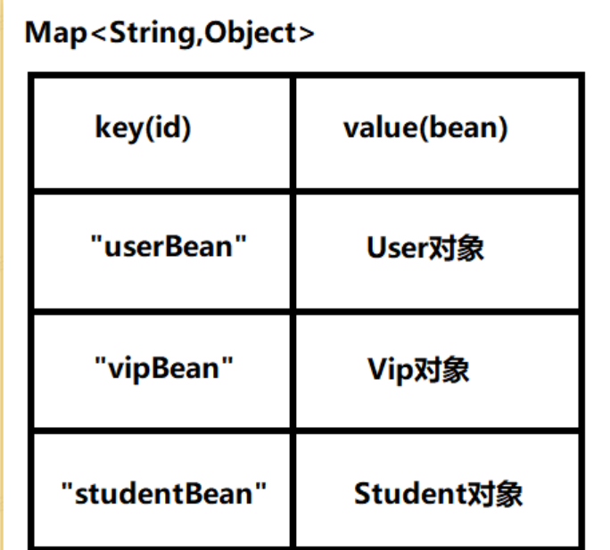
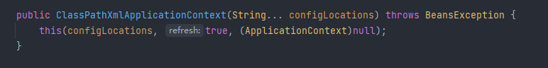

# Spring6的第一个程序解析
- junit这个包的默认作用域是test
  - 解决1：在项目结构中将依赖的作用域设置成Compile
  - 解决2：pom.xml文件中修改作用域
  - 将需要实验test的包的文件属性设置尾Tests
- 在spring的配置文件中id是不能重名的
- spring是通过反射调用类的无参数构造方法来创建对象的，所以要想让spring给你创建对象，必须保证无参数构造方法是存在的
- Spring通过反射创建对象，原理如下
```
// dom4j解析beans.xml文件，从中获取class的全限定类名
// 通过反射机制调用无参数构造方法创建对象
Class clazz = Class.forName("com.laterya.spring6.bean.User");
Object obj = clazz.newInstance();
```
- 创建好的对象存储在map集合中
- spring配置文件的名字可自定义
- spring的配置文件可以有多个，在ClassPathXmlApplicationContext构造方法的参数上传递文件路径即可
- 在spring配置文件中配置的bean可以任意类，只要这个类不是抽象的，并且提供了无参数构造方法
- 如果需要访问特有的属性和方法时，object需要向下转型，可以以下方式解决
```
User user = applicationContext.getBean("userBean", User.class);
```
- ApplicationContext的超级父接口BeanFactory
```
BeanFactory beanFactory = new ClassPathXmlApplicationContext("spring.xml");
Object vipBean = beanFactory.getBean("vipBean");
System.out.println(vipBean);
```
BeanFactory是Spring容器的超级接口。ApplicationContext是BeanFactory的子接口

# Spring6启动Log4j2日志框架
1. 引入Log4j2的依赖
```xml
<!--log4j2的依赖-->
<dependency>
  <groupId>org.apache.logging.log4j</groupId>
  <artifactId>log4j-core</artifactId>
  <version>2.19.0</version>
</dependency>
<dependency>
  <groupId>org.apache.logging.log4j</groupId>
  <artifactId>log4j-slf4j2-impl</artifactId>
  <version>2.19.0</version>
</dependency>
```
2. 在类的根路径下提供log4j2.xml配置文件（文件名固定为：log4j2.xml，文件必须放到类根路径下。）
```xml
<?xml version="1.0" encoding="UTF-8"?>

<configuration>

    <loggers>
        <!--
            level指定日志级别，从低到高的优先级：
                ALL < TRACE < DEBUG < INFO < WARN < ERROR < FATAL < OFF
        -->
        <root level="DEBUG">
            <appender-ref ref="spring6log"/>
        </root>
    </loggers>

    <appenders>
        <!--输出日志信息到控制台-->
        <console name="spring6log" target="SYSTEM_OUT">
            <!--控制日志输出的格式-->
            <PatternLayout pattern="%d{yyyy-MM-dd HH:mm:ss SSS} [%t] %-3level %logger{1024} - %msg%n"/>
        </console>
    </appenders>

</configuration>
```
3. 使用
```
Logger logger = LoggerFactory.getLogger(Spring6Test.class);
logger.info("this is a log message");
```